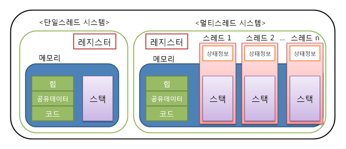
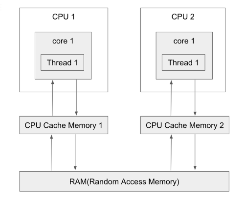

# 동시성 제어 분석 보고서

## 목차
- [1. 멀티 쓰레드 환경에서의 동시성 문제](#1-멀티-쓰레드-환경에서의-동시성-문제)
  - [1.1 메모리 구조](#11-메모리-구조)
  - [1.2 가시성(Visibility) 문제](#12-가시성visibility-문제)
  - [1.3 원자성(Atomicity) 문제](#13-원자성atomicity-문제)
- [2. synchronized](#2-synchronized)
  - [2.1 개요](#21-개요)
  - [2.2 사용 방법](#22-사용-방법)
  - [2.3 장단점](#23-장단점)
- [3. ReentrantLock](#3-reentrantlock)
  - [3.1 특징](#31-특징)
  - [3.2 기본 사용법](#32-기본-사용법)
  - [3.3 synchronized vs ReentrantLock 비교](#33-synchronized-vs-ReentrantLock-비교)
  - [3.4 프로젝트 적용 코드](#34-프로젝트-적용-코드)
  - [3.5 락 적용 전/후 비교](#35-락-적용-전후-비교)
  - [3.6 개선 필요 사항](#36-개선-필요-사항)

---

## 1. 멀티 쓰레드 환경에서의 동시성 문제

프로세스 내의 멀티 쓰레드 환경에서는 동시성 문제가 발생할 수 있다. 그 원인으로는 크게 다음 2가지가 존재한다.

1. **가시성 문제**
2. **원자성 문제**

### 1.1 메모리 구조

멀티 쓰레드는 다음과 같은 메모리 구조를 가진다:
- **독립**: 각 쓰레드는 고유의 **스택 메모리**를 소유
- **공유**: 모든 쓰레드가 **힙** 및 **메서드 영역**을 공유



---

### 1.2 가시성 문제

공유 자원의 값을 읽는 과정에서 **각 쓰레드가 다른 값을 바라보는 문제**가 발생한다.

#### 1.2.1 발생 원인

멀티코어 환경에서 각 CPU 코어는:
- 독립적인 **CPU 캐시(L1/L2 Cache)**와 **레지스터**를 보유
- 공유 메모리에 접근하기 전에 캐시를 먼저 확인
- 한 쓰레드가 수정한 값이 메인 메모리에 즉시 반영되지 않을 수 있음



#### 1.2.2 가시성 문제 시나리오

1. **Thread 1**이 메인 메모리에서 `runningFlag = true`를 읽어 CPU 캐시에 저장
2. **Thread 2**가 `runningFlag = false`로 변경하고 메인 메모리에 쓰기
3. **Thread 1**은 여전히 캐시된 `true` 값을 참조 → **변경 사항을 인식하지 못함**

#### 1.2.3 코드 예시

```java
public class VisibilityProblem {

    static boolean runningFlag = true;  // 공유 변수

    public static void main(String[] args) throws InterruptedException {

        // Thread 1: runningFlag가 false가 될 때까지 무한 루프
        new Thread(() -> {
            System.out.println("Thread 1 started");
            while (runningFlag) {
                // 무한 루프 - runningFlag 변경을 감지하지 못함
            }
            System.out.println("Thread 1 end");
        }).start();

        // Thread 2: 1초 후 runningFlag를 false로 변경
        new Thread(() -> {
            try {
                Thread.sleep(1000);
            } catch (InterruptedException e) {
                e.printStackTrace();
            }
            System.out.println("Thread 2 changing runningFlag to false");
            runningFlag = false;
            System.out.println("Thread 2 end");
        }).start();
    }
}
```

**실행 결과:**
```text
Thread 1 started
Thread 2 changing runningFlag to false
Thread 2 end
(Thread 1은 종료되지 않고 계속 실행)
```

**문제:**
- Thread 2에서 `runningFlag`를 `false`로 변경했지만, Thread 1은 이를 인식하지 못함
- Thread 1은 최초에 읽어들인 `true` 값을 CPU 캐시에 보관하여 계속 참조
- **JIT 컴파일러 최적화**도 문제를 악화시킴:
  - 컴파일러가 "runningFlag가 루프 내에서 변경되지 않는다"고 판단
  - 메인 메모리 접근 없이 레지스터에 캐싱된 값만 사용하도록 최적화

**방안:**
- `volatile` 키워드를 사용하면 항상 메인 메모리에서 값을 읽고 씀
- CPU 캐시를 거치지 않고 직접 메인 메모리에 접근
- 모든 쓰레드가 동일한 최신 값을 볼 수 있도록 보장

---

### 1.3 원자성(Atomicity) 문제

하나의 작업이 **중단 없이 완전히 실행되어야 하는데**, 중간에 다른 쓰레드가 개입하여 **예상치 못한 결과**가 발생하는 문제

#### 1.3.1 발생 원인

`cnt++` 같은 단순해 보이는 연산도 실제로는 **3단계**로 구성됨:
1. **Read**: 메모리에서 현재 값 읽기
2. **Modify**: 값을 변경 (예: +1)
3. **Write**: 변경된 값을 메모리에 쓰기

이 과정 중간에 **컨텍스트 스위칭**이 발생하면 데이터 불일치 발생

#### 1.3.2 원자성 문제 시나리오

**초기값: cnt = 0**

| 시간 | Thread A | Thread B | cnt 값 (메모리) |
|------|----------|----------|----------------|
| t1 | cnt 읽기 (0) | - | 0 |
| t2 | cnt + 1 = 1 계산 | - | 0 |
| t3 | **컨텍스트 스위칭** | cnt 읽기 (0) | 0 |
| t4 | - | cnt + 1 = 1 계산 | 0 |
| t5 | - | cnt = 1 쓰기 | **1** |
| t6 | cnt = 1 쓰기 | - | **1** ❌ |

**예상 결과**: cnt = 2
**실제 결과**: cnt = 1 (한 번의 증가가 손실됨)

이를 **경쟁 상태**라고 부른다.

#### 1.3.3 코드 예시

```java
public class AtomicityProblem {

    static int cnt = 0;  // 공유 변수

    public static void main(String[] args) throws InterruptedException {

        // Thread 1: cnt를 읽고 100ms 후 +1
        new Thread(() -> {
            int read = cnt;  // 1. 읽기: cnt = 0
            System.out.println("Thread 1 read: " + read);
            try {
                Thread.sleep(100);  // 컨텍스트 스위칭 시뮬레이션
            } catch (InterruptedException e) {
                throw new RuntimeException(e);
            }
            cnt = cnt + 1;  // 2. 쓰기: cnt = 1
            System.out.println("Thread 1 write: " + cnt);
        }).start();

        // Thread 2: cnt를 읽고 100ms 후 +1
        new Thread(() -> {
            int read = cnt;  // 1. 읽기: cnt = 0 (Thread 1이 아직 쓰지 않음)
            System.out.println("Thread 2 read: " + read);
            try {
                Thread.sleep(100);
            } catch (InterruptedException e) {
                throw new RuntimeException(e);
            }
            cnt = cnt + 1;  // 2. 쓰기: cnt = 1 (Thread 1의 변경 덮어쓰기)
            System.out.println("Thread 2 write: " + cnt);
        }).start();

        Thread.sleep(300);  // 모든 쓰레드 완료 대기
        System.out.println("최종 결과: " + cnt);
    }
}
```

**실행 결과:**
```text
Thread 1 read: 0
Thread 2 read: 0
Thread 1 write: 1
Thread 2 write: 1
최종 결과: 1
```

**문제 분석:**
- 두 쓰레드가 모두 `cnt = 0`을 읽음 (동시 읽기)
- 각각 +1 연산 수행
- 두 쓰레드 모두 `cnt = 1`을 씀 (한 번의 증가 손실)
- **예상값**: 2, **실제값**: 1

---

### 1.4 쓰레드 동기화

> **쓰레드 동기화란?**
> - 여러 쓰레드가 동시에 공유 데이터에 접근하여 발생하는 데이터 불일치 문제를 해결하기 위한 것
> - 자원 접근 순서를 제어하는 과정
> - 공유 데이터가 사용되어 동기화가 필요한 영역을 **임계 영역**이라고 함

---

## 2. synchronized

### 2.1 개요

`synchronized`는 Java에서 제공하는 **기본적인 동시성 제어 방식**이다.

**특징:**
- 한 번에 하나의 쓰레드만 임계 영역에 진입 가능
- 자바의 모든 객체에는 **고유 락**이 내장되어 있으며, `synchronized`는 이를 활용
- **클래스 락**: static 메서드는 클래스 객체의 락 사용 (모든 인스턴스가 공유)
- **인스턴스 락**: 인스턴스 메서드는 해당 인스턴스의 락 사용

#### 2.1.1 락의 범위 예시

```java
public class Main {

    public static void main(String[] args) throws InterruptedException {

        LockTest lt1 = new LockTest(1);
        LockTest lt2 = new LockTest(2);

        run(() -> lt1.firstStaticCall(1));   // static 메서드 호출
        run(() -> lt2.secondStaticCall(2));  // static 메서드 호출
        // static 메서드 간에 락을 공유하여 lt1이 락을 반환하기까지 lt2가 대기
        Thread.sleep(500);
        System.out.println("=========================================================");

        run(() -> lt1.firstInstanceCall());  // 인스턴스 메서드 호출
        run(() -> lt2.secondInstanceCall()); // 인스턴스 메서드 호출
        // 각 인스턴스 간의 고유 락이 존재하기 때문에 lt2는 lt1의 락 반환과 무관하게 실행
    }

    public static class LockTest {
        int id;

        LockTest(int id) {
            this.id = id;
        }

        synchronized void firstInstanceCall() throws InterruptedException {
            System.out.println("firstInstanceCall 시작, id: " + id + ", 시작시간: " + System.currentTimeMillis());
            Thread.sleep(300);
            System.out.println("firstInstanceCall 종료, id: " + id + ", 종료시간: " + System.currentTimeMillis());
        }

        synchronized void secondInstanceCall() throws InterruptedException {
            System.out.println("secondInstanceCall 호출, id: " + id + ", 호출시간: " + System.currentTimeMillis());
        }

        synchronized static void firstStaticCall(long id) throws InterruptedException {
            System.out.println("firstStaticCall 시작, id: " + id + ", 시작시간: " + System.currentTimeMillis());
            Thread.sleep(300);
            System.out.println("firstStaticCall 종료, id: " + id + ", 종료시간: " + System.currentTimeMillis());
        }

        synchronized static void secondStaticCall(long id) throws InterruptedException {
            System.out.println("secondStaticCall 호출, id: " + id + ", 호출시간: " + System.currentTimeMillis());
        }
    }

    @FunctionalInterface
    interface ThrowingRunnable {
        void run() throws Exception;
    }

    static void run(ThrowingRunnable run) {
        new Thread(() -> {
            try {
                run.run();
            } catch (Exception e) {
                throw new RuntimeException(e);
            }
        }).start();
    }
}
```

**실행 결과:**
```text
firstStaticCall 시작, id: 1, 시작시간: 1761231953726
firstStaticCall 종료, id: 1, 종료시간: 1761231954038
secondStaticCall 호출, id: 2, 호출시간: 1761231954038
=========================================================
firstInstanceCall 시작, id: 1, 시작시간: 1761231954238
secondInstanceCall 호출, id: 2, 호출시간: 1761231954239
firstInstanceCall 종료, id: 1, 종료시간: 1761231954553
```

---

### 2.2 사용 방법

#### 2.2.1 메서드 레벨 동기화

```java
public class Counter {
    private int count = 0;

    // 인스턴스 메서드 동기화 (this 락 사용)
    public synchronized void increment() {
        count++;
    }

    // static 메서드 동기화 (Counter.class 락 사용)
    public static synchronized void staticMethod() {
        // 모든 인스턴스가 공유하는 락
    }
}
```

**락의 범위:**
- **인스턴스 메서드**: 해당 객체(`this`)에 대한 락
- **static 메서드**: 클래스 객체(`Counter.class`)에 대한 락

#### 2.2.2 블록 레벨 동기화

```java
public class Counter {
    private int count = 0;
    private final Object lock = new Object();

    public void increment() {
        // 특정 객체에 대한 동기화 (락 범위 최소화 가능)
        synchronized(lock) {
            count++;
        }
    }

    public void decrement() {
        // this 객체에 대한 동기화
        synchronized(this) {
            count--;
        }
    }
}
```

---

### 2.3 장단점

#### 장점
1. **사용 간편**: 키워드만 추가하면 동기화 적용
2. **자동 락 해제**: 메서드/블록을 벗어나면 자동으로 락 해제
3. **재진입 가능**: 같은 쓰레드가 여러 번 락 획득 가능

#### 단점
1. **타임아웃 불가**: 락을 무한정 대기 (데드락 위험)
2. **인터럽트 불가**: 락 대기 중인 쓰레드를 깨울 수 없음
3. **공정성 제어 불가**: 특정 쓰레드가 무한정 대기하는 기아 상태에 빠질 수 있음
4. **락 범위 제한적**: 메서드 또는 블록 내에서만 사용 가능
5. **가상 쓰레드에서 쓰레드 고정**:
   - Java 21의 가상 쓰레드는 플랫폼 쓰레드를 공유
   - `synchronized` 블록 진입 시 가상 쓰레드가 **플랫폼 쓰레드에 고정**됨
   - 고정된 플랫폼 쓰레드는 다른 가상 쓰레드가 사용할 수 없어 **병렬성 감소**

---

## 3. ReentrantLock

### 3.1 특징

- `synchronized`보다 더 많은 기능 제공
- **재진입 가능(Reentrant)**: 같은 쓰레드가 여러 번 락 획득 가능

> **재진입이 불가능하다면?**
> 락을 보유한 쓰레드가 다시 락을 획득하기 위해 대기 상태에 빠짐 → 데드락 발생
---

### 3.2 기본 사용법

```java
import java.util.concurrent.locks.ReentrantLock;

public class Counter {
    private int count = 0;
    private final ReentrantLock lock = new ReentrantLock();

    public void increment() {
        lock.lock();  // 락 획득
        try {
            count++;
        } finally {
            lock.unlock();  // 반드시 finally에서 해제!
        }
    }
}
```
### 3.3 synchronized vs ReentrantLock 비교

| 특징 | synchronized | ReentrantLock |
|------|-------------|-------------|
| **자동 락 해제** | O | X |
| **타임아웃** | X| O |
| **인터럽트** | X| O |
| **공정성 제어** | X| O |
| **재진입** | O | O |


### 3.4 프로젝트 적용 코드

```java
// LockManager.java - 사용자별 락 관리
@Component
public class LockManager {
    private final Map<LockKey, ConcurrentHashMap<Long, ReentrantLock>> lockMap = new EnumMap<>(LockKey.class);

    @PostConstruct
    public void init() {
        for (LockKey key : LockKey.values()) {
            lockMap.put(key, new ConcurrentHashMap<>());
        }
    }

    public ReentrantLock getLock(LockKey key, Long id) {
        return Optional.ofNullable(lockMap.get(key))
                .map(conMap -> conMap.computeIfAbsent(id, k -> new ReentrantLock()))
                .orElseThrow(() -> new NoLockKeyException(ErrorCode.LOCK_KEY_NOT_FOUND, key));
    }
}

// LockAspect.java - AOP를 통한 선언적 락 관리
@Aspect
@Component
@RequiredArgsConstructor
public class LockAspect {
    private final LockManager lockManager;

    @Around(value = "@annotation(lockAnn) && args(id, ..)")
    public Object around(ProceedingJoinPoint joinPoint, LockAnn lockAnn, long id) throws Throwable {
        long waitTime = lockAnn.waitTime();
        TimeUnit timeUnit = lockAnn.timeUnit();
        LockKey lockKey = lockAnn.lockKey();

        Lock lock = lockManager.getLock(lockKey, id);

        if (lock.tryLock(waitTime, timeUnit)) {
            try {
                return joinPoint.proceed();
            } finally {
                lock.unlock();
            }
        } else {
            throw new GetLockException(ErrorCode.LOCK_GET_FAIL, id);
        }
    }
}

// LockAnn.java - 락 어노테이션 정의
@Inherited
@Retention(RetentionPolicy.RUNTIME)
@Target(ElementType.METHOD)
public @interface LockAnn {
    long waitTime() default 3000L;  // 기본 대기 시간: 3초
    TimeUnit timeUnit() default TimeUnit.MILLISECONDS;
    LockKey lockKey() default LockKey.USER;
}

// UserPointServiceImpl.java - 실제 적용
@Service
@RequiredArgsConstructor
public class UserPointServiceImpl implements UserPointService {

    private final UserPointRepository userPointRepository;
    private final PointHistoryService pointHistoryService;

    @LockAnn  // default: waitTime = 3000ms
    @Override
    public UserPointDTO addUserPoint(Long userId, Long amount) {
        //...
        return UserPointDTO.from(result);
    }

    @LockAnn
    @Override
    public UserPointDTO useUserPoint(Long userId, Long amount) {
        //...
        return UserPointDTO.from(result);
    }
}
```

### 3.5 락 적용 전/후 비교

**예시 : 포인트 충전 테스트** 
```java
        @Test
        void 충전_다회_동시성_테스트() throws InterruptedException {
            //given
            long userId = 1L;
            PointChargeDTO pt = new PointChargeDTO(1000L);
            int threadPool = 7;

            //when
            executeConcurrentTest(threadPool, () -> {
                try {
                    mvc.perform(patch("/point/{id}/charge", userId)
                            .contentType(MediaType.APPLICATION_JSON)
                            .content(objectMapper.writeValueAsString(pt))
                    );
                } catch (Exception e) {
                    throw new RuntimeException(e);
                }
            });

            //then
            UserPointDTO dto = userPointService.getUserPoint(userId);
            assertThat(dto.point()).isEqualTo(pt.amount() * threadPool);
        }
```
> **기대값** : 쓰레드수 7 * 충전양 1000 = 7000 <br>
> **락 미적용시** :  < 7000  비정상 <br>
> **락 적용 시** : 7000 정상


### 3.6 개선 필요 사항

- **리트라이 부재**: 락 획득 실패 시 즉시 예외 발생 → 재시도 로직 추가 고려
- **락 획득 키의 비유동성**: 첫 번째 파라미터가 `long` 타입의 `id` 변수여야 함 → SpEL 표현식으로 개선 가능

---

**이미지 출처**
- https://jtm0609.tistory.com/275
- https://woovictory.github.io/2018/12/26/OS-MultiThread-Concept/